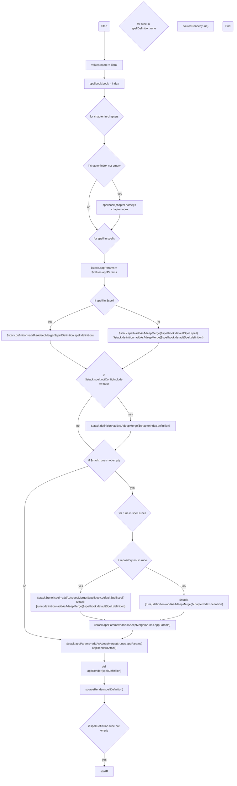

```mermaid
  graph TB
    start("Start")
    setName["values.name = 'libro'"]
    setBook["spellbook.book = index"]
    startChapterLoop{"for chapter in chapters"}
    chapterIndexCheck{"if chapter.index not empty"}
    setChapter["spellbook[chapter.name] = chapter.index"]
    startSpellLoop{"for spell in spells"}
    setAppParams["$stack.appParams = $values.appParams"]
    spellInCheck{"if spell in $spell"}
    setDefinitionSpell["$stack.definition=addAsAdeepMerge($spellDefinition.spell.definition)"]
    elseDefault["$stack.spell=addAsAdeepMerge($spellbook.defaultSpell.spell)<br>$stack.definition=addAsAdeepMerge($spellbook.defaultSpell.definition)"]
    notConfigIncludeCheck{"if $stack.spell.notConfigInclude == false"}
    addChapterDefinition["$stack.definition=addAsAdeepMerge($chapterIndex.definition)"]
    runesCheck{"if $stack.runes not empty"}
    startRuneLoop{"for rune in spell.runes"}
    repositoryInRuneCheck{"if repository not in rune"}
    setDefaultRune["$stack.[rune].spell=addAsAdeepMerge($spellbook.defaultSpell.spell)<br>$stack.[rune].definition=addAsAdeepMerge($spellbook.defaultSpell.definition)"]
    addChapterDefinitionRune["$stack.[rune].definition=addAsAdeepMerge($chapterIndex.definition)"]
    setAppParamsRune["$stack.appParams=addAsAdeepMerge($runes.appParams)"]
    appRender["$stack.appParams=addAsAdeepMerge($runes.appParams)<br>appRender($stack)"]
    appRenderFunction["def appRender(spellDefinition)"]
    sourceRender["sourceRender(spellDefinition)"]
    runeCheckAppRender{"if spellDefinition.rune not empty"}
    startRuneLoopAppRender{"for rune in spellDefinition.rune"}
    sourceRenderRune["sourceRender(rune)"]
    EndFlow("End")
    
    start --> setName
    setName --> setBook
    setBook --> startChapterLoop
    startChapterLoop --> chapterIndexCheck
    chapterIndexCheck --> |yes| setChapter
    chapterIndexCheck --> |no| startSpellLoop
    setChapter --> startSpellLoop
    startSpellLoop --> setAppParams
    setAppParams --> spellInCheck
    spellInCheck --> |yes| setDefinitionSpell
    spellInCheck --> |no| elseDefault
    setDefinitionSpell --> notConfigIncludeCheck
    elseDefault --> notConfigIncludeCheck
    notConfigIncludeCheck --> |yes| addChapterDefinition
    notConfigIncludeCheck --> |no| runesCheck
    addChapterDefinition --> runesCheck
    runesCheck --> |yes| startRuneLoop
    runesCheck --> |no| appRender
    startRuneLoop --> repositoryInRuneCheck
    repositoryInRuneCheck --> |yes| setDefaultRune
    repositoryInRuneCheck --> |no| addChapterDefinitionRune
    setDefaultRune --> setAppParamsRune
    addChapterDefinitionRune --> setAppParamsRune
    setAppParamsRune --> appRender
    appRender --> appRenderFunction
    appRenderFunction --> sourceRender
    sourceRender --> runeCheckAppRender
    runeCheckAppRender --> |yes| startR
```